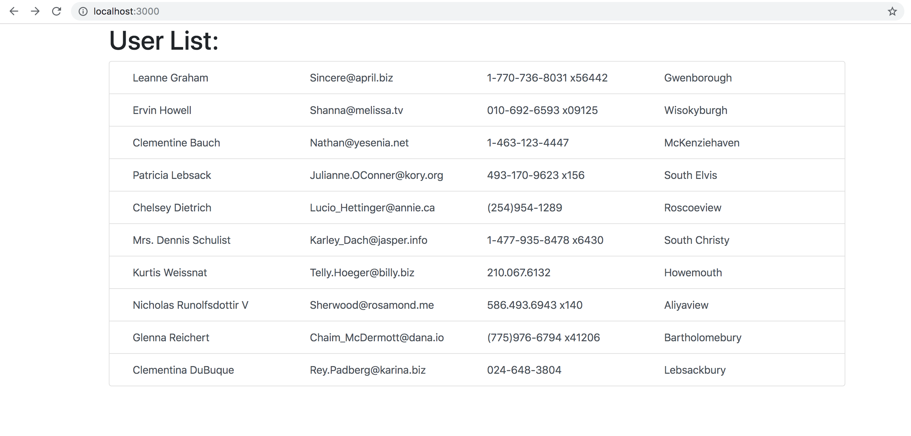

This project was bootstrapped with [Create React App](https://github.com/facebook/create-react-app).

This app shows how to use Redux Saga, Redux Router, React Boostrap for displaying two simple pages with users data:
list page

and details pages

## Available Scripts

In the project directory, you can run:

### `yarn start`

Runs the app in the development mode. 
Open [http://localhost:3000](http://localhost:3000) to view it in the browser.
